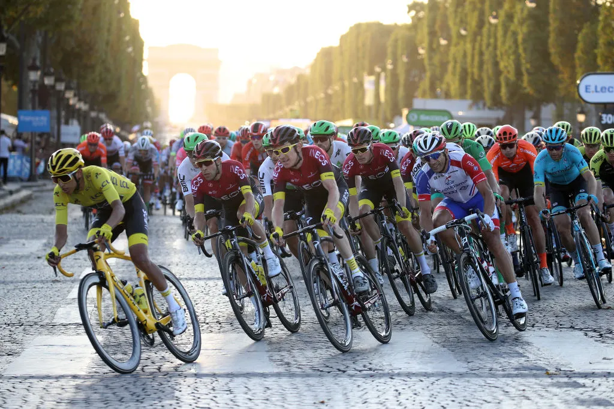

## Overview

Task is to build prediction models for members of Biker-Interest-Group and try to predict which bike-tours will be of interest to bikers. You can use all the extra information provided, such as biker's previous interests, his/her demographic details, past tours, friend circle etc. This dataset is derived from a real world scenario; so take care of sanitizing/handling real data.

#### About
- Provided Dataset has feature information and friends-network. Information regarding tours and its participants is also available. Use the data in creative ways to come up a ML model that predicts bikers preference among tours. Supervised data is available about biker's preference is available in train.csv.

- ML model used here is XGBoost Classifier